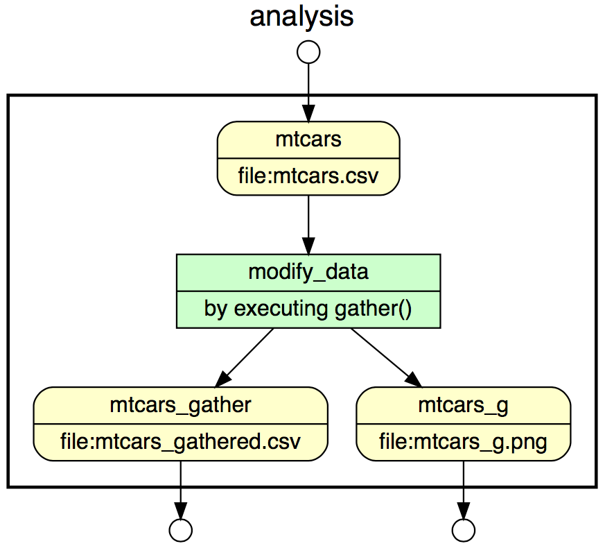

```{r setup, include=FALSE}
knitr::opts_chunk$set(echo = TRUE)
```
* A test use case package: https://test.arcticdata.io/#view/urn:uuid:943a7035-579a-4e34-8214-3de2f617f5e8

The package consists of:
1) mtcars.csv
2) analysis.R
3) mtcars_gathered.csv
4) mtcars_g.png


* Script for provenance capture in YW
```{r}
#@begin analysis
#@in mtcars @URI file:mtcars.csv

#@begin modify_data @desc by executing gather()
#@in mtcars
library(ggplot2)
library(readr)
library(tidyr)

# Read in the data
mtcars <- read.csv("./mtcars.csv")

# Modify the data
mtcars_g <- gather(mtcars)

#@out mtcars_gather @URI file:mtcars_gathered.csv
#@out mtcars_g @URI file:mtcars_g.png
# Save the modified data to disk
write.csv(mtcars_g, "./mtcars_gathered.csv")

# Make a plot and save it to disk
ggplot(mtcars_g, aes(key, value)) + geom_boxplot()
ggsave("./mtcars_g.png", width = 6, height = 4)
#@end gather

#@out mtcars_gather
#@out mtcars_g
#@end analysis
```

```{r pressure, echo=FALSE, fig.cap="A caption", out.width = '100%'}

```
