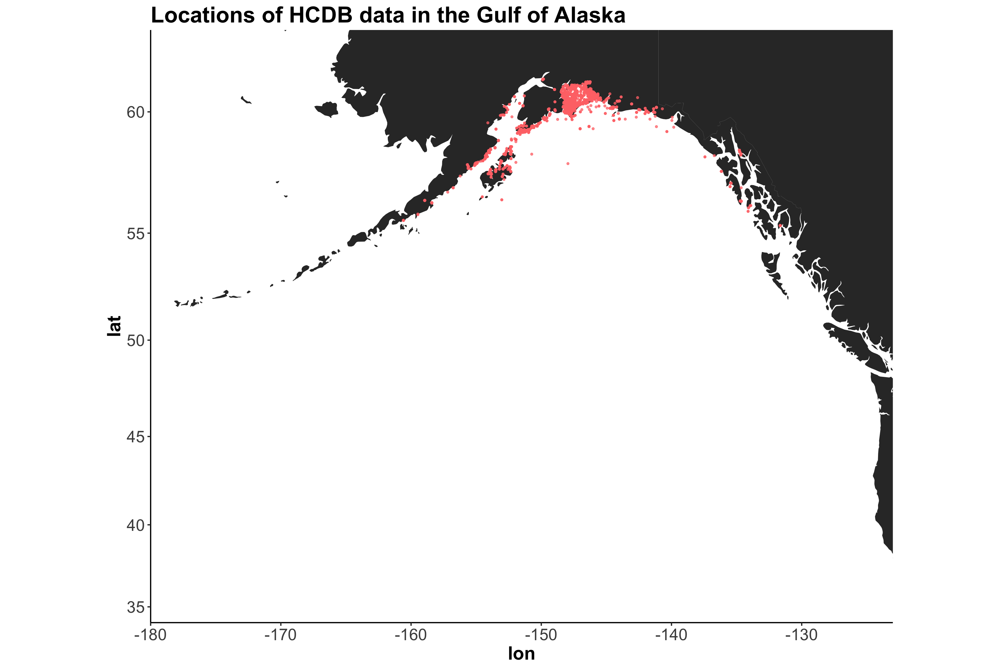

```{r setup, include=FALSE}
knitr::opts_chunk$set(echo = TRUE)
knitr::opts_knit$set(root.dir = "/Users/eunjungpark/Documents/dataone/DataONE_2018_Summer_Intern_Project1/reproduce/data")
```

### Reproduce the intermediate outputs
##### Required steps to modify the script
+ Changing the path of the file in "setwd()" and for output
+ Fix the file name, e.g., sample.csv -> Sample.csv and Non-EVOS SINs.csv -> Non-EVOS_SINs.csv

##### A patch recording the updates
```{r}
system("diff -u /Users/eunjungpark/Documents/dataone/DataONE_2018_Summer_Intern_Project1/reproduce/data/Total_PAH_and_Alkanes_GoA_Hydrocarbons_Clean.R /Users/eunjungpark/Documents/dataone/DataONE_2018_Summer_Intern_Project1/reproduce/data/new_Total_PAH_and_Alkanes_GoA_Hydrocarbons_Clean.R > /Users/eunjungpark/Documents/dataone/DataONE_2018_Summer_Intern_Project1/reproduce/data/merge.patch")
```
```{r}
system("tab2space -unix -t2 /Users/eunjungpark/Documents/dataone/DataONE_2018_Summer_Intern_Project1/reproduce/data/merge.patch", intern = TRUE)
```

##### Patch the updates to the script
```{r}
system("patch -p0 < /Users/eunjungpark/Documents/dataone/DataONE_2018_Summer_Intern_Project1/reproduce/data/merge.patch", intern = TRUE)
```

##### Run script to reproduce
```{r}
#setwd("/Users/eunjungpark/Documents/dataone/DataONE_2018_Summer_Intern_Project1/reproduce/data")
source("Total_PAH_and_Alkanes_GoA_Hydrocarbons_Clean.R")
```
```{r}
file.exists("rp_Total_Aromatic_Alkanes_PWS.csv")
```


### Reproduce the final results (analysis outputs)
##### Required steps to modify the script
+ Set the path for the csv file that the script reads (e.g., using setwd())
+ Add Coordinate Node (CN) and Member Node (MN) information to connect the repository
+ Fix unused object "hcdb2" -> "hcdb"
+ Filter out null values (on the column "matrix" in the dataset) that are plotted in the results
+ Set color for the plot in the first output
+ (Optional) Change the title of the artifacts if wanted to make it same as original
+ Add "ggsave()" to save each plot into each file
+ Write a file from binary data which is shape file, rename the file to zip, and the unzip it
+ Fix incorrect library "rColorBrewer" -> "RColorBrewer"

##### A patch recording the updates
```{r}
system("diff -u /Users/eunjungpark/Documents/dataone/DataONE_2018_Summer_Intern_Project1/reproduce/data/hcdbSites.R /Users/eunjungpark/Documents/dataone/DataONE_2018_Summer_Intern_Project1/reproduce/data/new_hcdbSites.R > /Users/eunjungpark/Documents/dataone/DataONE_2018_Summer_Intern_Project1/reproduce/data/genResults.patch")
```
```{r}
system("tab2space -unix -t2 /Users/eunjungpark/Documents/dataone/DataONE_2018_Summer_Intern_Project1/reproduce/data/genResults.patch", intern = TRUE)
```

##### Patch the updates to the script
```{r}
system("patch -p0 < /Users/eunjungpark/Documents/dataone/DataONE_2018_Summer_Intern_Project1/reproduce/data/genResults.patch", intern = TRUE)
```

##### Run script to reproduce
```{r}
source("hcdbSites.R")
```

```{r}


```
