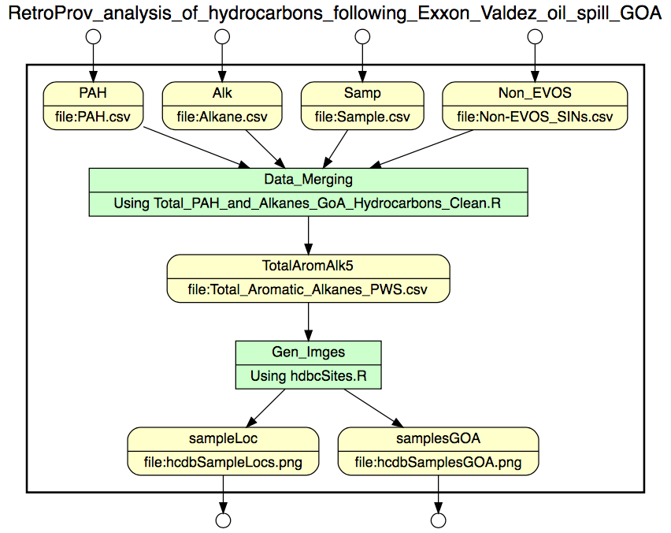

```{r setup, include=FALSE}
knitr::opts_chunk$set(echo = TRUE)
```
* A test use case package: https://test.arcticdata.io/#view/urn:uuid:943a7035-579a-4e34-8214-3de2f617f5e8

The package consists of:
1) mtcars.csv
2) analysis.R
3) mtcars_gathered.csv
4) mtcars_g.png


* Script for prospective provenance in YW
```{r}
#@begin RetroProv_analysis_of_hydrocarbons_following_the_Exxon_Valdez_oil_spill_GOA
#@in PAH @URI file:PAH.csv
#@in Alk @URI file:Alkane.csv
#@in Samp @URI file:Sample.csv
#@in Non_EVOS @URI file:Non-EVOS_SINs.csv

#@begin Data_Merging @desc Using Total_PAH_and_Alkanes_GoA_Hydrocarbons_Clean.R
#####################################################
####  GoA Hydrocarbon Data Cleaning              ####
####   March 2015 ; Script by Rachael Blake      ####
#####################################################

# Set your working directory (this should be changed to download from the repository later)
#setwd("C:/Users/rblake/Documents/NCEAS/GoA Portfolio Effects WG/Hydrocarbon Data")

#@in PAH
#@in Alk
#@in Samp
#@in Non_EVOS
#############################
# Calculate Total Aromatics  
PAH <- read.csv("PAH.csv")  # read in the PAH data file
head(PAH) ; str(PAH)

# Taking means of all chemical compound concentrations to get Total PAHs
PAH$TtlAromatic <- rowSums(PAH[,24:71], na.rm=T)   # sum the chemicals across rows
PAH$TPAH_adj <- rowSums(PAH[,c(24:26,28,30:45,47:71)], na.rm=T)  ; PAH[c(25:50),]  # sum different chemicals across rows
library(plyr) 
PAH1 <- arrange(PAH, Sin)  ; head(PAH1)  # arrange by the Sample ID (Sin)
TotalAromat <- PAH1[PAH1$Sin > 0, -c(3,8,15:22,24:71)]   # remove rows with Sin < zero and individual compound columns


##########################
# Extract Total Alkanes
Alk <- read.csv("Alkane.csv")  # read in the Alkanes data file
#library(plyr)  # only need to run this if you haven't loaded plyr previously
Alk <- rename(Alk, c("QCBatch"="QCbatch")) # rename QCBatch column to match QCbatch column from PAH table
head(Alk) ; str(Alk)

# extracting Total Alkanes from the spreadsheet
TtlAlk <- Alk[,c(1,2,4:7,9:14,20,51)]   
#library(plyr)  # only need to run this if you haven't loaded plyr previously
TtlAlk1 <- arrange(TtlAlk, Sin)
TtlAlkane <- TtlAlk1[TtlAlk1$Sin > 0, ]   # remove rows with Sin < zero 


#########################
# Adding the data columns together
names(TotalAromat) ; names(TtlAlkane)  # make sure the columns are all named the same
#library(plyr)  # only run this if you haven't loaded plyr previously
AromAlk <-  join(TotalAromat, TtlAlkane, by="Sin", type="full")


#############################
# Adding in the Sample information 
SamIDs <- read.csv("sample.csv")
#library(plyr)
Samples1 <- arrange(SamIDs, Sin)  ; head(Samples1) # arranges the rows by Sample ID 
  

######################################
# Joining the two data frames together
TotalAromAlk1 <- join(AromAlk, Samples1, by="Sin", type="full")  # join data frames
TotalAromAlk <- arrange(TotalAromAlk1, Sin)  # sort by Sample ID (Sin)
head(TotalAromAlk) ; tail(TotalAromAlk)


###################################
# Cleaning and filtering the data
# remove the rows where QCERROR is "BIAS" and check the result using unique()
TotalAromAlk2 <- TotalAromAlk[!TotalAromAlk$QCERROR %in% "BIAS",]  ; unique(TotalAromAlk2$QCERROR)
# remove the rows where SampleType is "blank" and check the result using unique()
TotalAromAlk3 <- TotalAromAlk2[!TotalAromAlk2$SampleType %in% c("blank","BLANK","SPIKE"),] 
unique(TotalAromAlk3$SampleType)
# Remove rows with NAs in _BOTH_ the Aromatics and Alkanes columns
TotalAromAlk3a <- TotalAromAlk3[which(!is.na(TotalAromAlk3$TOTALKANES) | 
                                      !is.na(TotalAromAlk3$TtlAromatic)),]
# Remove rows with "BLANK", "QCSED" or "FBLANK" in the matrix column and check the result using unique()
TotalAromAlk3b <- TotalAromAlk3a[!TotalAromAlk3a$matrix %in% c("FBLANK","BLANK","QCSED"),]
unique(TotalAromAlk3b$matrix)
# Replace NAs in the column "Funding" with "EVOSTC" when the value in column "FundingSource" is "EVOSTC"
TotalAromAlk3b$Funding[is.na(TotalAromAlk3b$Funding) & TotalAromAlk3b$FundingSource=="EVOSTC"] <- "EVOSTC"
# Remove "FundingSource" column because it is redundant now
TotalAromAlk4 <- TotalAromAlk3b[,!names(TotalAromAlk3b) %in% c("FundingSource")]

### Remove NON-EVOSTC Samples (list confirmed by Mark Carls at NOAA Auk Bay Lab)
Non_EVOS <- read.csv("Non-EVOS SINs.csv") # read in the list of non_EVOS Sample ID numbers
head(Non_EVOS) ; nrow(Non_EVOS)

TotalAromAlk5 <- TotalAromAlk4[!TotalAromAlk4$Sin %in% Non_EVOS$Sin,]
head(TotalAromAlk5) ; nrow(TotalAromAlk5)
nrow(TotalAromAlk4) - nrow(TotalAromAlk5)  # should equal 440 even though there are 390 rows in
                                           # Non-EVOS because there are duplicates!!!

# Copy entries from "AnalysisType" column to "matrix" column only for rows with NA in matrix column
TotalAromAlk5$matrix <- as.character(TotalAromAlk5$matrix) # have to first make these columns character strings
TotalAromAlk5$AnalysisType <- as.character(TotalAromAlk5$AnalysisType)

TotalAromAlk5$matrix[is.na(TotalAromAlk5$matrix)] <- TotalAromAlk5$AnalysisType[is.na(TotalAromAlk5$matrix)] 

# unify the case of levels in the matrix column (ex: sediment and SEDIMENT)
library(dplyr)
TotalAromAlk5 <- TotalAromAlk5 %>%
                               mutate(matrix = tolower(matrix)) 

#########################
#@out TotalAromAlk5 @URI file:Total_Aromatic_Alkanes_PWS.csv
# create new CSV data file  (this should be changed to upload to repository later)
write.csv(TotalAromAlk5, "extdata/output/Total_Aromatic_Alkanes_PWS.csv", row.names=F)

#@end Data_Merging


#@begin Gen_Imges @desc Using hdbcSites.R
## HCDB sampling locations and sample type
## 

library(dataone) #needed to run
library(dplyr)

## Initialize a client to interact with DataONE
cli <- D1Client()

#@in TotalAromAlk5 @URI file:Total_Aromatic_Alkanes_PWS.csv
#@out sampleLoc @URI file:hcdbSampleLocs.png
#@out samplesGOA @URI file:hcdbSamplesGOA.png
hcdb=read.csv('Total_Aromatic_Alkanes_PWS.csv',header=T)
hcdb2=hcdb %>%
  mutate(matr2=tolower(matrix)) %>%
  filter(!matr2=='fblank') %>%
  filter(!matr2=='blank') %>%
  filter(!matr2=='us') %>%
  filter(!matr2=='qcsed')
  
### mapping

library(rworldmap)
library(rworldxtra)
library(rgdal)
library(ggplot2)


world=getMap('low',projection=NA)
worldB=world[!is.na(world$continent),]
world2=worldB[worldB$continent=='North America' & worldB$LON<0,]
fWorld=fortify(world2)
colMap=c('dimgrey','black')

extDf=data.frame(xmin=-157,xmax=-143,ymin=56,ymax=62)

ggplot(data=fWorld) +
  geom_map(map=fWorld,aes(x=long,y=lat,map_id=id))+
  coord_map(xlim = c(-180, -123),ylim = c(34, 63))+ 
  geom_point(data=hcdb,mapping=aes(x=as.numeric(LONG), y=as.numeric(LAT),colour=matr2),size=1,alpha=0.7, shape=20) +
  #scale_color_manual(values=tsColors,name='category')+ #,breaks=rev(cnLevels),labels=rev(cnLevels)
  #geom_rect(data=extDf,aes(xmin=xmin,xmax=xmax,ymin=ymin,ymax=ymax),color='gray53',fill=NULL,lwd=0.5,alpha=0.75)+
  ggtitle('Locations of HCDB samples in the Gulf of Alaska')+
  xlab('lon')+
  theme(axis.line=element_line(),
        panel.grid.major = element_blank(),
        panel.grid.minor = element_blank(),
        panel.border = element_blank(),
        panel.background = element_blank(),
        legend.position='none',
        axis.text=element_text(size=14),
        title=element_text(size=16,face="bold"))+
  guides(colour = guide_legend(override.aes = list(size=6)))


### ZOOOOOM in:
tempFilename <- 'akMapData.zip'
akMapObject=getD1Object(cli,'df35d.431.1')  ## shp file from dataONE
akMapData <- getData(akMapObject, fileName=tempFilename)
unzip(tempFilename, list=FALSE) ### ERRORS, not sure why, line 21: Error in name == "GADM" : comparison (1) is possible only for atomic and list types

state <- readOGR('GIS','statep010')
stateDf=fortify(state)

## Colors:
library('rColorBrewer')

ggplot(data=stateDf, aes(y=lat, x=lon)) +
  geom_map(map=stateDf,aes(x=long,y=lat,map_id=id))+
  coord_map(xlim = c(-157, -143),ylim = c(56, 62))+ 
  #scale_fill_manual(values=colMap)+
  geom_point(data=hcdb, aes(x=as.numeric(LONG), y=as.numeric(LAT),colour=matrix), size=2, shape=20,alpha=0.75) + 
  scale_colour_brewer(palette='Set1',name='Sample type')+#,breaks=cnLevels,labels=cnLevels
  ggtitle('Locations of HCDB samples in Northern GOA')+
  theme(axis.line=element_line('black'),
        panel.grid.major = element_blank(),
        panel.grid.minor = element_blank(),
        panel.border = element_blank(),
        panel.background = element_blank(),
        legend.position='right',
        axis.text=element_text(size=14),
        title=element_text(size=16,face="bold"))+
  guides(colour = guide_legend(override.aes = list(size=6)))

############################################

#@end Sampling_Locations

#@out sampleLoc
#@out samplesGOA
#@end RetroProv_analysis_of_hydrocarbons_following_the_Exxon_Valdez_oil_spill_GOA
```


